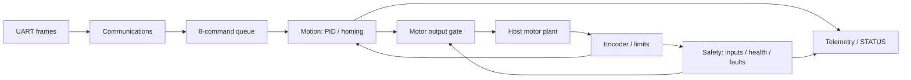

# Real-Time Embedded Motion Controller

A C11/FreeRTOS single-axis motion controller built to exercise an STM32-oriented
firmware architecture: prioritized Motion, Safety, Communications and Telemetry
tasks, encoder-feedback PID position control, PWM, E-stop, limits, no-motion
protection, watchdog supervision, validated reset and one-stage homing.

**Functionally validated on a Windows host with a deterministic simulated motor;
also cross-compiled as genuine STM32F407VG Cortex-M4F firmware.** The ARM image
uses the official FreeRTOS Cortex-M4F port and STM32 peripheral implementations,
excluding the host simulator. No physical STM32, motor/encoder or Renode execution
has been used. Configured rates are not measured hardware timing or certified safety.

**Phase 9: ARM firmware target.** Motion runs at 100 Hz, Safety at 50 Hz and
Telemetry at 10 Hz; the numerical plant advances at 1000 steps per simulated
second. Representative positive/negative moves finish within 1 encoder count,
with 1-count overshoot. HOME from 1500 counts takes 10.25 simulated seconds.
[Phase 9 validation report](docs/phase-9.md) distinguishes host measurements,
verified ARM build properties, and future execution work.

Final Debug and Release validation each passed **103/103 tests**, including
protocol, HAL isolation and control/safety/homing replay. Compiler warnings: **0**.
All **18 demos** passed; two final metrics runs produced byte-identical JSON.



## Build, test and demonstrate

Required: Windows multicore host, PowerShell, CMake 3.20+, Ninja and x64 MinGW GCC.
Validated tools: MSYS2 UCRT64 GCC 16.1.0, CMake 4.4.0, Ninja 1.13.2. Put
`C:\msys64\ucrt64\bin` on PATH. Git is needed to clone a repository, not to build
an extracted source tree. FreeRTOS V11.2.0 is vendored with license and SHA256
verification; host builds need no build-time download or ARM toolchain.

From the repository root (paths containing spaces are supported):

```powershell
./scripts/build.ps1
./scripts/test.ps1
./scripts/test.ps1 -Configuration Release
./scripts/demo.ps1
./scripts/metrics.ps1
```

Scripts create build directories and throw on configure/build/test/demo failure.
For the independent STM32 target, put Arm GNU Toolchain **15.2.Rel1** on PATH:

```powershell
./scripts/build-arm.ps1
./scripts/build-arm.ps1 -Configuration Debug
```

ELF, BIN, MAP and structural audit reports are generated under `build/arm-Release`
or `build/arm-Debug`. See [embedded build instructions](docs/embedded-build.md)
for pins, memory, flags, startup, IRQ rules and execution limitations.

Run host validation serially; concurrent native simulators/build load can disrupt
the Windows port's timing-sensitive scheduling checks.
For a fresh independent build without deleting existing artifacts:

```powershell
./scripts/test.ps1 -BuildDirectory build/host-clean
```

The default demo is the finite RTOS/peripheral regression, including an injected
E-stop. It deliberately ends latched ESTOP. Each demo self-checks and exits.
There is no interactive serial console or GUI.

## Recommended demonstration sequence

Use these existing scenarios as the primary presentation sequence. Each starts a
fresh process; they are not one persistent machine session.

```powershell
./scripts/demo.ps1 -Scenario closed-loop   # absolute moves both ways, relative move
./scripts/demo.ps1 -Scenario homing        # HOME, zero reference, positive departure, MOVE
./scripts/demo.ps1 -Scenario estop         # interrupt motion, reject unsafe RESET, recover
```

The default demo shows real STATUS/HELP output. `stall` and `watchdog` add useful
fault evidence. Run the whole public catalog with `./scripts/demos.ps1`; it derives
names from `demo.ps1` and saves output to `build/demo-Debug-<scenario>.log`.

| Scenario(s) | Purpose |
| --- | --- |
| `peripherals` (default), `nominal` | RTOS tasks, commands, heartbeat and optional sensor injection |
| `burst`, `rx-overflow`, `diagnostic-loss` | Queue/RX/diagnostic overload policies |
| `uart-long`, `uart-tx-failure` | Bounded frame rejection and output failure isolation |
| `plant-open-loop`, `plant-limits` | Independent dynamics/coasting and mechanical endpoints |
| `closed-loop` | Four PID moves with metrics and sparse playback |
| `estop`, `stall`, `encoder-failure` | E-stop and shared no-motion detection/recovery |
| `watchdog`, `limit-fault` | Heartbeat supervision and unexpected limit fault |
| `homing`, `homing-estop`, `homing-timeout` | Reference, departure, interruption and 40-second deadline |

All 18 remain useful; overload and fault cases are regression demonstrations,
not duplicate ways to showcase one nominal move.

## Commands and diagnostics

Supported firmware commands: `MOVE <position_counts>`, `MOVE_REL <offset_counts>`,
`HOME`, `STOP`, `ESTOP`, `RESET`, `STATUS`, `HELP`. `SPEED <integer>` is recognized
but deferred and reports NOT_IMPLEMENTED in healthy ordinary operation.

```text
ACK QUEUED command=MOVE value=2000
MOTION command=MOVE value=2000 ACK ACCEPTED
MOTION COMPLETE output=zero
```

These mean queue admission, execution acceptance and later stable completion,
respectively. STATUS now supplies five coherent lines: motion, safety, heartbeat/
watchdog supervision, homing and queue/completion counters. Periodic telemetry
uses the same field schema at 10 Hz. [Protocol reference](docs/protocol.md) covers
syntax, units, errors, snapshot timing, HELP and the diagnostic-format change.

Host fault injection uses scenario code and host-only APIs. There is **no SIM text
parser**; firmware rejects `SIM ...` as UNKNOWN_COMMAND. Diagnostics use bounded
queues/UART writes and can drop under overload; they do not gate safety actions.

## Configuration and measured behavior

| Configuration | Value |
| --- | --- |
| Motion / Safety / Telemetry priorities | 3 / 4 / 1; Communications 2 |
| Motion / Safety / Telemetry periods | 10 / 20 / 100 ms |
| Communications idle health wait | 50 ms |
| Kernel tick / command queue | 100 Hz / 8 copied commands |
| PID Kp / Ki / Kd | 0.006 / 0.0002 / 0.0015 |
| PID duty / driver defensive bounds | ±0.8 / [-1,+1] normalized PWM |
| Completion | ±3 counts and speed ≤25 counts/s for 20 samples |
| Heartbeat freshness / watchdog timeout | 150 / 1000 ms |
| No-motion qualification | ≥0.30 PWM, ≤25 counts/s continuously for 500 ms |
| HOME | -0.30 normalized PWM; 40000 ms timeout; no PID during seek |

| Measured scenario | Result in simulated time |
| --- | --- |
| MOVE 1000 → 2000 | Completion 4350 ms; settling 4830 ms; final error / overshoot 1 / 1 count |
| MOVE 1000 → 500 | Completion 3100 ms; settling 3630 ms; final error / overshoot 1 / 1 count |
| Moving / idle GPIO E-stop | Input-to-detection 10 / 20 ms; detection-to-zero 0 ms |
| HOME from 500 / 1500 / 4000 | 3590 / 10250 / 26920 ms; logical zero, PWM zero |

`./scripts/metrics.ps1` obtains settings from compiled defaults and runs nine actual
scenarios. It prints a human-readable report and writes `build/metrics-Debug.json`.
Test/demo counts are discovered, not hardcoded; an incremental build cannot establish
warning count, so that metric is explicitly unmeasured. Metrics do not replace a
full test sweep. Identical same-build JSON results are expected on repeat runs.

Position is logical encoder counts, not millimeters. Default plant scale is one
raw count per axis unit. Settling includes two seconds of observation after
completion; final one-count coasting can make settling later than completion.
HOME changes the logical reference, not mechanics. At the still-active home switch,
output stays zero until explicit positive departure; negative drive is blocked and
the allowance expires on switch release. Already latched limit faults cannot be
bypassed with HOME.

## Validation and boundaries

Tests cover startup, actual FreeRTOS scheduling/queues/notifications, protocol,
peripherals, plant, PID/motion, safety, homing, output formatting and HAL isolation.
Control, safety and homing replay compare fresh processes from the same build.
Project and compiled upstream sources use `-Wall -Wextra -Wpedantic -Werror`.
See the [Phase 9 build/regression evidence](docs/phase-9.md) and
[historical Phase 8 feature traceability](docs/phase-8.md).

Windows GitHub Actions is configured for UCRT64 Debug/Release builds and the full
CTest suite, including isolation/replays. Remote CI has not been run. The optional
Linux POSIX CMake path remains unvalidated and is excluded from the claimed CI
baseline. ARM CI is deferred pending a pinned toolchain installation job; local
ARM clean builds and structural checks are recorded in the Phase 9 report.

The motor model omits electrical behavior, load variation, noise and backlash.
Zero PWM removes drive and allows coasting; it does not prove mechanical rest.
The host watchdog stores refresh data and does not autonomously reset the process.
Real ISR timing, hardware PWM/encoder signals, physical watchdog reset and hardware
safety remain unvalidated. Static RTOS objects do not imply a heap-free desktop
process or known Cortex-M stack requirements.

Portable application/control/protocol/safety and RTOS code depend on driver
interfaces. Host platform, plant and runners are separate CMake targets. The ARM
configuration links the same portable sources against STM32 implementations and
the GCC/ARM_CM4F port. [Target mappings and remaining obligations](docs/stm32-port.md)
describe compiled foundations; peripheral execution remains unvalidated.

Read [architecture](docs/architecture.md), [real-time design](docs/real-time-design.md),
[protocol](docs/protocol.md), [control](docs/control.md), [safety](docs/safety.md),
[homing](docs/homing.md), [simulation](docs/simulation.md) and
[dependency provenance](third_party/README.md).
Historical reports: [1](docs/phase-1.md), [2](docs/phase-2.md), [3](docs/phase-3.md),
[4](docs/phase-4.md), [5](docs/phase-5.md), [6](docs/phase-6.md), [7](docs/phase-7.md),
[8](docs/phase-8.md).
They record behavior at those phases, not the current feature set.
