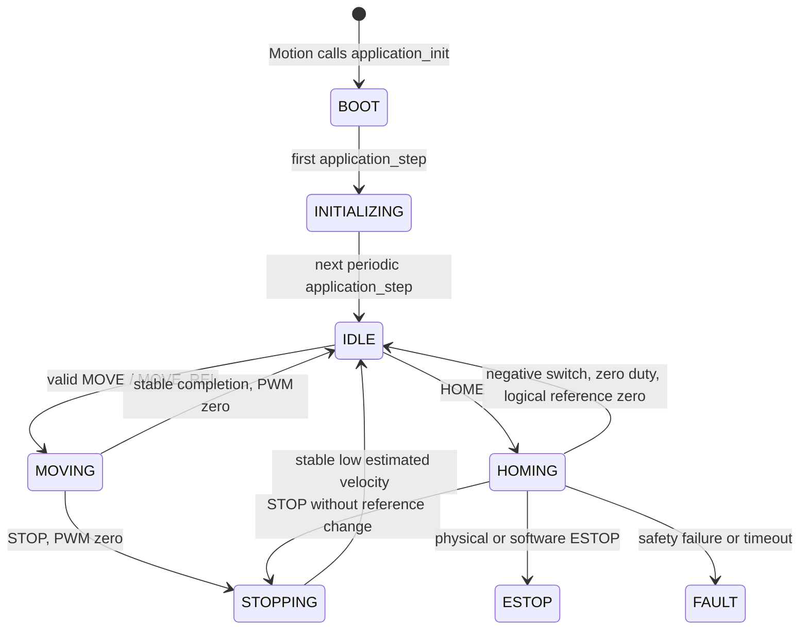
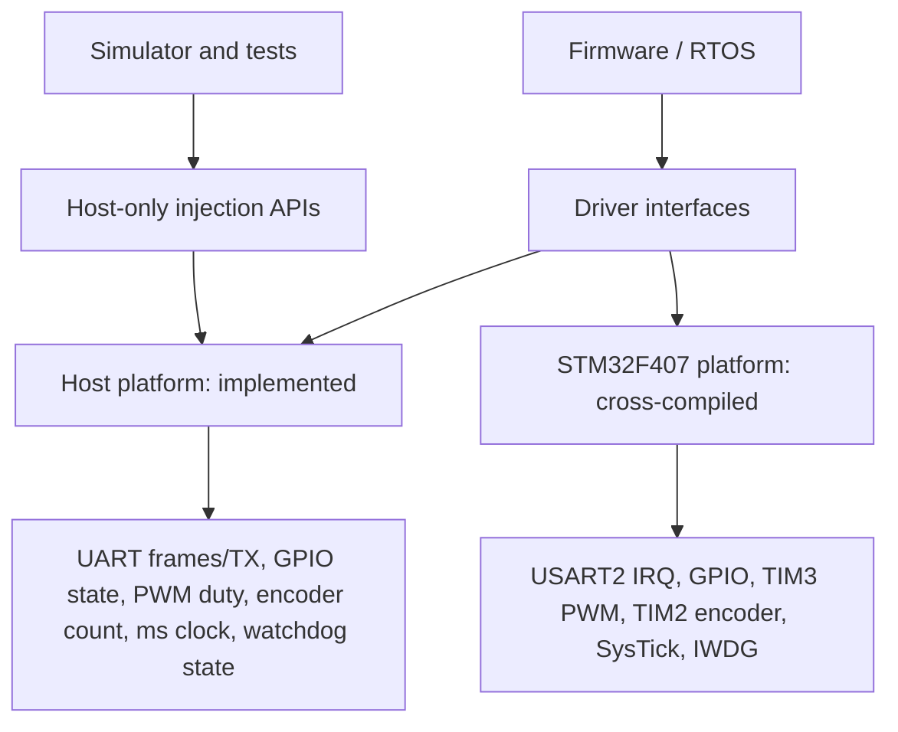
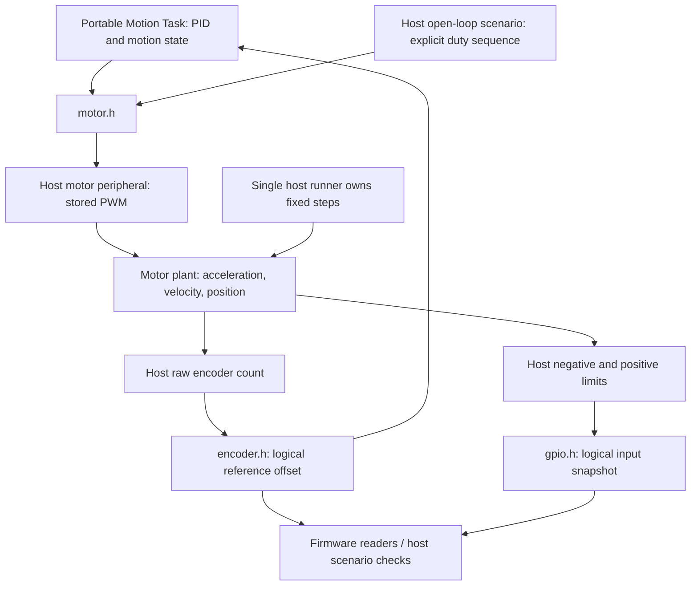
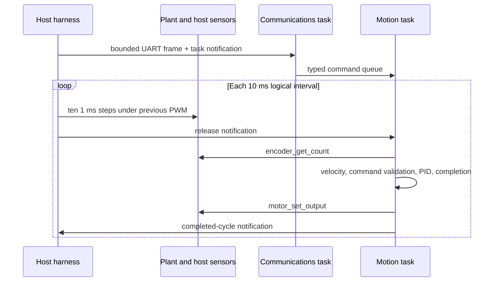

# Architecture through Phase 9

The host design below remains functionally validated. Phase 9 adds a separate
STM32F407VG build of the same portable sources, with target startup, FreeRTOS
configuration and register drivers. [Embedded build](embedded-build.md) describes
memory/interrupt ownership. Target execution is not yet proven.

The existing Phase 1 application/HAL separation is retained. The new RTOS adapter
owns execution; application startup logic has not been rewritten.

## Build components

| Component | Responsibility/dependencies |
| --- | --- |
| `motion_app` | Portable startup state machine; depends on platform operations, not FreeRTOS or host headers |
| `motion_control` | Pure PID, encoder-feedback motion and one-stage homing; no FreeRTOS or simulator dependency |
| `firmware_support` | Pure command parser, heartbeat, fault and safety policy logic, no OS dependency |
| `freertos_kernel` | Unmodified V11.2.0 kernel subset; host port/tick hook or GCC/ARM_CM4F with separate target configuration |
| `motion_rtos` | Four tasks, command bus, bounded diagnostics, health/snapshot synchronization and periodic scheduling |
| `platform_host` | Six peripheral models, startup initialization, injectable timer/log/UART services and host access hooks; no FreeRTOS dependency |
| `platform_host_rtos` | Preserved static RX queue/script adapter, UART binding and bounded telemetry formatting |
| `motion_controller_host` | Composes RTOS and host adapters, immutable input script and finite validation harness |
| `motion_controller_startup` | Preserved Phase 1 deterministic startup runner |
| `plant_model` | Host-only fixed-step motor dynamics and encoder/limit publication; depends on plain `platform_host`, not FreeRTOS |
| `motion_controller_plant` | Single-threaded open-loop/limit scenarios, logical-time advancement and low-rate plant snapshots |
| `motion_controller_closed_loop` | Coordinates the real Motion task and fixed plant steps with notification handshakes; UART commands, metrics and recorded playback |
| `motion_controller_stm32` | Separate ARM configuration: same portable sources, STM32 startup/drivers, Cortex-M4F FreeRTOS port; no simulator |

There are no host-control includes in `firmware/app`, `firmware/tasks`, protocol or
health logic. Platform definitions are resolved at link time. The host runner
installs a kernel-tick clock and bounded log sink before scheduling, while the
original runner retains its manually advanced logical clock. Firmware task code
uses `drivers/uart.h`, `drivers/gpio.h`, `drivers/encoder.h`, `drivers/motor.h`
and `drivers/telemetry.h`, not host script controls. The existing `platform_time_ms`
and `platform_motor_disable` functions delegate to the timer and motor drivers.
`drivers/input.h` retains the host adapter's frame type alias. The unused
receive/pending wrappers were removed; Communications uses UART directly.

## Controller-state ownership



Motion exclusively owns `application_t` for startup and `motion_controller_t`
for subsequent motion. Startup stepping is called only during BOOT/INITIALIZING;
motion state is then published through the protected runtime snapshot.
INITIALIZING is not a hardware self-test. Safety owns the retained safety override
and atomically inhibits motor output. Motion synchronizes its private state to that
override and aborts without incrementing completion. The homing module executes in
Motion, using fixed duty and the negative GPIO switch instead of PID. Its reference
change, state transition and post-home allowance use the same synchronized adapter.
Successful homes have a separate result/counter; see [homing](homing.md).

## Data and event flow

```mermaid
sequenceDiagram
    participant ISR as Simulated tick ISR
    participant RX as Host RX queue
    participant C as Communications
    participant Q as Command queue
    participant M as Motion owner
    participant T as Telemetry
    ISR->>RX: xQueueSendFromISR(frame)
    ISR->>C: vTaskNotifyGiveFromISR
    C->>RX: uart_try_read_line
    C->>C: bounded syntax/value parsing
    C->>Q: xQueueSend(typed command, zero wait)
    C-->>T: queued/error diagnostic record
    M->>Q: xQueueReceive(zero wait), max two per cycle
    M->>M: validate state/target; execute MOVE / MOVE_REL / STOP
    M-->>T: accepted/rejected; later completion event
    T->>T: format diagnostics and heartbeat snapshot
```

Input frame lifetime ends with the Communications iteration. Queue submission
copies a command by value, so Motion does not retain pointers into an input buffer.
The 8-command queue rejects new submissions when full. The 16-frame host RX queue
drops/counts overflow. The 32-record diagnostic queue drops/counts overflow without
blocking its producers. The host script is copied to 32-event static storage before
scheduling and cannot be edited by running tasks.

Heartbeats and diagnostics statistics are fixed-size structures updated/read in
short task critical sections. ISR-side input statistics are read with interrupts
masked by the selected host port's critical section. No use of `volatile` is
substituted for RTOS synchronization of these shared structures.

## Lifetime and shutdown

RTOS queues and all task storage are static and created before the scheduler starts.
One initialization/run per process is supported. A host-only harness captures final
state, stops the input source, requests cooperative parking and ends the scheduler.
Tasks park at work boundaries so main does not resume console output while a task
is suspended inside stdio. Port-owned native threads and resources persist until
process exit; scheduler restart is outside this phase.

## Future platform work

Phase 3 provides stored PWM commands, injected encoder counts/reference offsets,
GPIO input states, UART RX/TX, millisecond timing and observable watchdog refresh.
Phase 4 connects those same driver implementations to a deterministic plant in a
separate host scenario runner. Phase 5 adds portable PID/motion control and a runner
connecting the real Motion task to that plant. Phase 6 adds the independent safety
policy, motor inhibit gate and deterministic fault scenarios; see [safety](safety.md).
Phase 9 adds a genuine STM32F407VG Cortex-M4F target with the GCC/ARM_CM4F port
and target platform sources. Host/simulator linkage is rejected by its audit.
Hardware/virtual-MCU execution remains unvalidated.

## Peripheral boundary and initialization



Before any RTOS objects or tasks are created, `platform_init` resets the motor
model first (zero output), then timer, GPIO and encoder. It validates UART
configuration (115200 baud metadata), then watchdog configuration (1000 ms).
UART/watchdog failures return false to the runner, which does not start the RTOS.
Infallible memory-only reset APIs return void instead of fake success booleans.
Reinitialization/configuration is a startup-only operation, not concurrent with tasks.

The runner creates runtime objects/tasks, selects the RTOS millisecond source
with explicit 10 ms resolution, installs host critical-section callbacks and
the bounded diagnostic log sink, binds the input script to UART, installs the
tick callback, then starts the scheduler. Motion still owns BOOT → INITIALIZING
→ IDLE. Only qualified Safety supervision refreshes the watchdog. Telemetry transmits via UART.

The plain host peripheral library is also linked into unit tests without FreeRTOS.
Short access hooks are no-ops for those single-threaded tests and are real RTOS
critical sections in the threaded runner. Driver calls/injections are task-context
operations, not native-thread or ISR-safe APIs. The RX adapter retains its separate
FreeRTOS FromISR queue path. Hooks are detached after scheduler return, when
firmware tasks have parked, before main reads peripheral results.

`hal_isolation` checks portable source/header includes and calls for host-specific
dependencies. It is a regression guard, not a proof of every possible preprocessor
expansion. The existing independent application test also remains intact.

## Deterministic plant and control boundary



The diagram shows alternative PWM owners. The preserved open-loop executable
drives the motor directly. In the closed-loop executable, the real Motion task
requests ordinary PWM while Safety controls final inhibit. A host harness owns the
plant and releases cycles; targeted gate/limit assertions also submit stale requests
to prove they cannot defeat safety. Portable firmware never includes `plant_model.h`
or calls `plant_step`.

Plant calculations are local to the owner. PWM sampling takes one short driver
access; raw encoder and both limit outputs are published under a single outer host
access hook with nested driver calls. No physics or logging occurs in that protected
publication. Hooks are no-ops in the open-loop runner and use RTOS critical sections
in the closed-loop runner. A notification handshake fixes PWM sampling order; arbitrary
native threads and ISRs cannot call this model. See [simulation](simulation.md).

Manual peripheral tests keep their existing direct injection APIs. Plant-connected
scenarios instead assign the plant sole ownership of raw encoder/automatic limits;
manual writes persist only until the next plant publication. E-stop and logical
encoder reference remain independent. One connected plant is supported per process.
Host stall/frozen-encoder controls now act at the dynamics/publication boundary
without exposing simulator data to firmware. The heartbeat observation filter is
configured before scheduling; only the host scenario changes its private drop mask.

The STM32 build replaces host motor/encoder/GPIO implementations with real
peripherals and omits `plant_model`, `motion_controller_plant` and the host
`motion_controller_closed_loop` runner entirely.

## Phase 5 execution handshake

Phase 6 additionally releases Safety before Motion on every second interval and
wakes Comms every interval. Safety evaluates GPIO, encoder response and heartbeat
records, then enforces the gate before acknowledging the release. Telemetry remains
independent. See [safety synchronization](safety.md) for authority and reset races.



The normal runner retains periodic `xTaskDelayUntil` scheduling. External cycle
release is selected before the closed-loop scheduler starts through portable RTOS
scheduling APIs; it exposes no simulator data to firmware. The host never calls
PID. Command admission, acceptance and completion remain distinct. Host metrics
and sampled control traces are printed after tasks park. See [control design](control.md)
for state policies, timing, quantization and finite-horizon metric definitions.

## Phase 8 consolidation

STATUS and TEL share one five-group [schema](protocol.md). Telemetry samples STATUS
at service time, copies runtime state under the existing critical section, and
formats outside it. No task, snapshot queue or control-path printing was added.
The source/target split was retained; see [porting inventory](stm32-port.md).
Startup and manual-input runners remain active regression coverage. Only the two
unused input receive/pending wrappers were removed. Strengthened HAL checks have
negative fixtures, including Windows header/API leakage and a FreeRTOS-name control.
