# Encoder-feedback position control — Phase 7

The real FreeRTOS Motion task now owns a portable position controller. It reads
only encoder counts, estimates velocity, handles typed MOVE/MOVE_REL/STOP commands,
runs PID and writes PWM through the existing motor interface. No plant position or
true velocity is used for firmware feedback. This is host-validated closed-loop
position control, not hardware-tuned or safety-complete control.

## PID primitive

`firmware/control/pid.c/.h` is independent of FreeRTOS, the application, UART,
Windows, STM32 and simulator headers. Configuration and arithmetic use `float`.
Each successful update uses an explicit positive time interval:

```text
error = target - measurement
I = clamp(previous_I + Ki * error * dt, I_min, I_max)
D = -(measurement - previous_measurement) / dt
output = clamp(Kp * error + I + Kd * D, output_min, output_max)
```

The first derivative sample is zero. Derivative on measurement avoids a target-step
kick; it still reacts to measured movement and encoder quantization. There is no
derivative filter, feedforward, trajectory generator or velocity-control loop.

The single anti-windup strategy is **clamping the integral contribution in PWM
units**. It is not conditional integration or back-calculation. Sustained saturation
can leave I at its bound, but cannot grow it without limit. Reset clears I and
measurement history; beginning a move seeds measurement history at the current
encoder position. Invalid/non-finite inputs or intermediate overflow return false
without modifying PID state or the caller's output.

## Selected configuration and tuning

`motion_default_config()` centralizes these settings:

| Parameter | Value | Meaning |
| --- | ---: | --- |
| Kp | 0.006 | PWM/count |
| Ki | 0.0002 | PWM/(count·s) |
| Kd | 0.0015 | PWM/(count/s) |
| Integral contribution | -0.005..+0.005 | PWM |
| Output range | -0.8..+0.8 | PWM |
| Valid targets | 0..5000 | logical encoder counts, inclusive |
| Position tolerance | ±3 | counts |
| Completion velocity threshold | 25 | counts/s magnitude |
| Completion dwell | 20 consecutive qualifying updates | Nominally 200 ms at 100 Hz |

The initial manual selection used the existing plant's gain/damping to choose a
moderate proportional response with derivative damping. Ignoring quantization and
saturation, Kp gives nominal position stiffness 2000×0.006 = 12 s⁻² and Kd adds
2000×0.0015 = 3 s⁻¹ to the plant's 4 s⁻¹ damping. This was a selection heuristic,
not an autotuning experiment or identified physical motor model. The integral
contribution was deliberately small because this plant has no persistent load.

Those initial gains passed the positive, negative, relative and multiple-target
scenarios without adjustment. The observed 1-count final errors and overshoots
support retaining them for this phase. The ±3-count tolerance allows quantization
and coast margin; the 20-sample dwell rejects transient passages through target.
These values are not claimed optimal and will need reconsideration for real encoder
resolution, noise, loads and control timing.

The PID output limit is the controller's only configured clamp. `motor_set_output`
retains its existing defensive [-1,1] clamp; tests verify that valid controller output
never reaches that outer protection. SPEED is deferred instead of pretending a PWM
limit is a measured velocity command.

## Position and velocity

Positions and targets are `int32_t` logical encoder counts. Default simulation
resolution is one count per axis unit; that is not a future hardware calibration.
The plant retains `double` mechanical state. Position differences and relative
target addition use `int64_t` intermediates, avoiding signed overflow before range
validation. Configured firmware travel is limited to ±1,000,000 counts to keep
individual counts exactly representable in float PID input.

Velocity is the signed encoder delta divided by dt. The first sample reports zero.
Delta arithmetic handles the encoder's modulo-2^32 wrap using unsigned subtraction
and explicit signed conversion. It assumes displacement below half the count range
between samples; an exactly half-range jump is ambiguous and rejected. Reference
changes during ordinary movement are not supported. HOME establishes reference only
after negative-switch detection and zero output, then resets the estimator history.

At one count and 10 ms, instantaneous velocity is quantized in 100 counts/s steps.
Thus the 25 counts/s completion threshold effectively requires no count change on
each qualifying sample. This is not proof of zero mechanical velocity. No plant
velocity, averaging window or hidden filter is used. Zero/non-finite dt, dt over one
second, failed encoder reads or invalid arithmetic disable output, cancel the active
move in the portable controller and invalidate feedback. The RTOS integration now
converts this failure into a retained INTERNAL fault and motor inhibit. INTERNAL
requires restart after service; ordinary RESET cannot establish arithmetic/device integrity.

## Commands, state and completion

The retained startup application performs BOOT -> INITIALIZING -> IDLE. Motion
calls startup stepping only during startup, then owns the motion controller state.

```mermaid
stateDiagram-v2
    BOOT --> INITIALIZING
    INITIALIZING --> IDLE
    IDLE --> MOVING: valid MOVE / MOVE_REL
    MOVING --> IDLE: position + velocity band for 20 updates; PWM zero
    MOVING --> STOPPING: STOP; PWM zero
    STOPPING --> IDLE: low estimated velocity for 20 updates
```



- `MOVE n`: accept only in IDLE with valid feedback and n within configured travel.
  Store target, reset PID/dwell, enter MOVING and start control.
- `MOVE_REL n`: compute current sampled encoder count + n using int64, validate,
  then use the same move path. It is relative to actual position, not the last target.
- MOVE/MOVE_REL while MOVING or STOPPING: `ERR INVALID_STATE`; active target unchanged.
- Below/above-range target: `ERR OUT_OF_RANGE`, with no motor activation.
- Zero-distance move: enter MOVING and require the normal dwell; no PWM is needed.
- `STOP`: remove drive immediately when Motion processes the command, clear PID,
  enter STOPPING from MOVING and wait for 20 low-velocity samples before IDLE. Plant
  damping causes coasting. This is not a braking profile or emergency stop.
- `STATUS`/`HELP`: supported. SPEED remains NOT_IMPLEMENTED in normal operation.
- `HOME`: accepted only from safe IDLE. A fixed -0.30 duty seeks the negative switch
  within 40000 ms, then sets logical reference zero and resets PID/velocity history.
  STOP aborts to STOPPING without changing reference. See [homing](homing.md).
- `ESTOP`: latched zero output; `RESET`: validate current safety conditions and
  recover to IDLE without replaying the target. Unsafe states reject MOVE/MOVE_REL,
  SPEED and HOME; STOP acknowledges safe output without clearing the latch.

The command queue's `ACK QUEUED` means transport admission. Motion separately emits
`ACK ACCEPTED` or its execution rejection. Only the later `MOTION COMPLETE` means
the move satisfied its completion rule. Diagnostics remain bounded and may drop;
control/state transitions do not depend on logging success.

While MOVING, both absolute position error <=3 counts and absolute estimated
velocity <=25 counts/s must hold for 20 consecutive samples. Any excursion resets
the counter. Completion sets PWM to zero, resets PID, increments the completed-move
counter and enters IDLE. Twenty samples span 19 intervals between first and last:
the zero-distance scenario completes 190 ms after its acceptance sample. IDLE does
not actively hold position. Coasting may change a count after completion.

Firmware telemetry exposes target, encoder position, estimated velocity, error,
bounded PID output, final PWM, dwell count and completed moves. Simulator-only
mechanical values never enter firmware telemetry or control.

## Deterministic FreeRTOS integration

The normal RTOS runner retains its 100 Hz tick and 10 ms Motion period using the
existing periodic wait. dt uses unsigned platform-millisecond differences, including
one wrap. Periodic overrun handling and priorities are unchanged.

`motion_controller_closed_loop` uses the same Motion task with external release:

1. A single host harness advances ten 1 ms plant steps under the previous PWM.
2. It advances manual logical time alongside those steps.
3. It notifies Motion and waits for that task's completion notification.
4. Motion samples the encoder, processes at most two queued commands, runs control,
   publishes the protected snapshot and acknowledges completion.
5. Only then does the harness advance the next plant interval.

This is 100 Hz control and 1000 Hz plant simulation, a fixed 10:1 ratio in logical
time. The harness never calls PID or the firmware controller directly. The same
four firmware tasks exist; one host harness takes the role of the previous finite
host test harness. No new firmware task, semaphore, mutex or application heap was
introduced. The one-second handshake timeout detects infrastructure failure; it
does not set dt or choose simulation steps. A failed handshake aborts the scenario.

Scenario frames enter the existing bounded UART RX adapter through an explicit
task-context injector. A task notification wakes higher-priority Comms, which parses
and queues them before the harness releases Motion. No FromISR call is fabricated.
The original tick/FromISR input tests remain intact in the periodic runner.

Motion requests PWM; Safety has final inhibit authority. Plant state belongs to the
harness; its short nested hooks publish encoder/limits while Motion waits. Safety
now uses the same notification handshake every 20 logical milliseconds, before the
coincident Motion update. Comms is notified each control cycle for logical-time
heartbeats; Telemetry retains tick scheduling and is noncritical. All tasks park
cooperatively before results are printed; Motion disables
the actuator when parking. Hooks are detached after scheduler return.

## Metrics and limitations

Metrics use firmware-visible encoder position and velocity at every control sample.
The host records a move's entire control result until completion, then observes
another 200 updates (2 seconds). Demo playback includes snapshots every 500 logical
milliseconds and completion; it is recorded output printed after scheduler shutdown,
not live wall-clock telemetry.

- Start/target: sampled encoder at command acceptance and validated target.
- Final position/error: last observation after the 2-second post-completion period;
  error is absolute final encoder count minus target.
- Overshoot: maximum directional count beyond target over the whole observation.
  For decreasing moves use target minus position. Zero-length moves report zero
  directional overshoot rather than dividing by zero.
- Settling time: beginning of the final uninterrupted run inside **both** position
  and velocity bands through the observation end. Every band exit invalidates the
  prior candidate. It is a finite-horizon observation, not proof of infinite settling.
- Completion time: first MOVING -> IDLE sample, measured from acceptance.
- Maximum PWM: largest absolute emitted controller PWM in the sampled sequence.
- Replay: same-build runs compare metrics and a hash of every sampled PWM bit
  pattern, encoder position, state and dwell count; no struct padding is hashed.

Settling can be later than completion: after a qualifying dwell, removing drive
allows a final one-count coast. That count change briefly produces a 100 counts/s
velocity estimate despite small mechanical speed. The demo does not hide it. All
tested completed moves remain inside the position band during post-observation.

See [Phase 5 report](phase-5.md) for actual metrics across all move scenarios.
Phase 6 adds [firmware safety](safety.md) independently of normal completion and
logging, with unchanged PID gains. There is no hardware fidelity, hard real-time
deadline guarantee, ARM binary, Renode execution or safety certification. Homing is
now implemented with the explicitly authorized positive-only post-home departure
allowance; ordinary PID gains and metrics remain unchanged.
