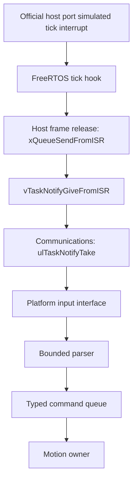

# Phase 2 — RTOS core

> Historical phase report. Behavior and test counts below describe Phase 2 only.
> See [Phase 8](phase-8.md) and [protocol](protocol.md) for the current host baseline.

## Scope and baseline

Phase 1's two tests passed before implementation. The existing application library,
startup state machine and HAL were preserved. The original finite startup runner
is now `motion_controller_startup`; `motion_controller_host` is the genuine
FreeRTOS executable. Phase 1 remains a historical report in `phase-1.md`.

This phase implements execution architecture, message passing and diagnostics.
It does not implement motion control or complete safety behavior. No physical
STM32 hardware was used, no ARM firmware was built, and Renode was not used.
No commits or pushes were performed.

## FreeRTOS integration

The unmodified FreeRTOS Kernel **V11.2.0** release is vendored as a minimal source
subset with its MIT license and per-file SHA256 manifest. CMake verifies the hashes
at configuration and builds `tasks.c`, `queue.c`, `list.c` and the selected port.
No fake RTOS calls, application heap allocation or dependency download at build
time is involved. See [dependency provenance](../third_party/README.md).

Windows uses the official **MSVC-MingW** port with the existing x64 MSYS2 UCRT64
compiler and the Windows `winmm` system library. A kernel-only execution test
proved this choice before adding the task architecture. No WSL, Docker or other
runtime is required for the Windows workflow.

The Linux CI path selects the official **ThirdParty/GCC/Posix** port and pthreads.
It is included but was not executed locally: the available WSL installation only
listed Docker Desktop, not a Linux development distribution. Remote GitHub CI has
not been run. Do not describe Linux or CI as validated on that basis.

## Tasks and scheduling

| Task | Priority | Release/wait | Role |
| --- | ---: | --- | --- |
| Safety | 4 | 20 ms / 50 Hz | Independent safety execution context and heartbeat; no safety decisions yet |
| Motion | 3 | 10 ms / 100 Hz | Owns application startup/state; consumes at most two typed commands per cycle |
| Communications | 2 | Notification; maximum idle wait 50 ms | Owns input parsing; handles up to four frames per batch, sends commands and reports health |
| Telemetry | 1 | 100 ms / 10 Hz | Copies coherent snapshots; drains at most 32 diagnostics per cycle; owns console output |
| HostHarness | 1 | One 1200 ms wait, then bounded shutdown polling | Simulator-only scenario validation and orderly finite process completion |
| Kernel idle | 0 | When nothing else is ready | Required by FreeRTOS |

The kernel tick is **100 Hz**, so one tick represents 10 ms. Motion, Safety and
Telemetry use `xTaskDelayUntil`, the return-value form behind `vTaskDelayUntil`.
The periods are in RTOS ticks, not measured wall time. A missed release increments
the applicable overrun counter, yields one tick, and resets its release anchor.
This avoids a high-priority catch-up loop and permits normal execution to resume.

The intended later 1 kHz control loop is deliberately not claimed here. The
Windows port schedules native threads using a simulated timer, and ordinary host
load can delay it. There is no physical timing evidence.

## Primitives, ownership and memory

| Primitive | Capacity/use | Reason |
| --- | --- | --- |
| Static FreeRTOS command queue | 8 copied `motion_command_t` objects | Transfers typed data from Communications to Motion without sharing input buffers |
| Static host RX queue | 16 copied input frames, each at most 64 bytes | Buffers simulated input until Communications drains it |
| Direct task notification | One counting notification on Communications | Signals input readiness independently of the transport buffer; repeated signals can coalesce |
| Static diagnostic queue | 32 fixed-size records | Higher-priority work never waits for console output |
| FreeRTOS critical sections | Short record updates/copies and nonblocking queue accounting | Protect coherent heartbeat/snapshot data and exact queue statistics |

No application semaphore or mutex is used. The queue APIs synchronize transferred
data, and a notification is sufficient for the single input consumer's wake-up.
The upstream host ports use native synchronization internally; those are not
application FreeRTOS mutexes and are not claimed as such.

All four firmware tasks, the finite host harness, queue storage, task control
blocks and nominal stack buffers are static. FreeRTOS provides static idle-task
memory. `configSUPPORT_DYNAMIC_ALLOCATION=0`; no heap implementation is compiled.
Windows creates native threads/events and OS-managed stacks internally. The POSIX
port additionally uses internal `malloc`/`free`. Statically allocating FreeRTOS
objects does not make either desktop process heap-free, nor do nominal task stack
buffers establish Cortex-M stack requirements.

Motion owns its `application_t`. Other tasks see only a snapshot. Heartbeat records
contain a count, last report timestamp and an explicit `seen` flag. Critical
sections protect task reports and diagnostic copies. The pure freshness helper
uses unsigned elapsed milliseconds and is tested over timestamp and counter wrap.
Telemetry labels reports older than 150 ms stale. It does not reset a watchdog or
raise a safety fault in this phase.

## Interrupt/event path



The host runner copies a time-ordered script into fixed storage before scheduling.
The tick hook releases at most 16 due frames per invocation, drops/counts RX
overflow, and notifies Communications once if any frame was accepted. Parsing,
formatting and application processing happen outside interrupt context.

These are real `FromISR` calls inside the official port's simulated tick context.
They are not calls from an arbitrary Windows thread pretending to be an ISR.
`xTaskIncrementTick` checks the yield-pending flag after invoking the hook, so the
void hook does not call `portYIELD_FROM_ISR` (the Windows macro returns a value).

On Cortex-M a UART/DMA or timer ISR must implement the input handoff, use the
appropriate interrupt-priority range for FreeRTOS APIs, and normally request the
port-specific yield at ISR exit. No NVIC priorities, ARM vectors or interrupt
latencies were tested. Releasing complete frames from a tick hook is a host
architecture test, not a UART baud-rate, byte-framing or electrical simulation.

## Commands and failure policies

The parser recognizes `STATUS`, `HELP`, `MOVE`, `MOVE_REL`, `SPEED`, `HOME`, `STOP`,
`ESTOP` and `RESET`. Numeric commands accept bounded signed 32-bit decimal values;
range validation for real motion is deferred. Syntax errors never enter the
command queue. Input length is explicit; 63 bytes is the accepted maximum.

`ACK QUEUED` acknowledges queue admission only. Motion reports receipt, provides
diagnostic STATUS/HELP responses, and reports `ERR NOT_IMPLEMENTED` for every
motion/safety action. In particular, `STOP` and `ESTOP` do not implement stopping
or emergency-stop behavior. Output cannot be enabled in this phase.

Full command queue: reject the newest command immediately, increment rejection
count and enqueue an `ERR QUEUE_FULL` diagnostic. RX full: drop/count the newest
frame. Diagnostic queue full: drop/count the new diagnostic without changing
state or command processing. Thus an ACK/ERR can itself be dropped; guaranteed
protocol delivery and flow control are not current features.

The input queue is the source of truth; notifications are readiness hints, not
one notification per frame. If frames remain after a four-frame batch,
Communications self-notifies and delays one tick, allowing lower-priority work
to run. The notification also times out to report Communications health while
input is idle. Critical tasks never wait on console output.

## Tests

CTest has nine cases; internal assertions are active in Debug and Release:

| Test | Evidence |
| --- | --- |
| `application_startup` | Existing BOOT → INITIALIZING → IDLE contract, output inhibit and failed logging |
| `host_smoke` | Original deterministic Phase 1 executable still works |
| `command_logic` | All command types, numeric boundaries/overflow, malformed arguments, bounded non-NUL input, maximum length and unchanged output on parse failure |
| `health_logic` | Never-seen/stale/fresh tasks, independent records, recovery and timestamp/counter wrap |
| `kernel_execution` | Actual task creation/priorities, periodic releases, missed-release recovery, typed FIFO copies, full-queue rejection/recovery, tick-ISR notification counting/clearing and diagnostic overflow/recovery |
| `rtos_nominal` | Four firmware tasks, IDLE, all nine typed commands consumed, one parser rejection, fresh health and ISR-triggered input |
| `rtos_burst` | Command queue reaches capacity and rejects excess commands while tasks/telemetry continue |
| `rtos_rx-overflow` | Receive overflow is counted; accepted frames are accounted for through parse/queue outcomes |
| `rtos_diagnostic-loss` | Deliberately full diagnostics do not prevent startup, command flow or heartbeats |

Integration scenarios check internal state and counters and return a failure exit
code when assertions fail; a printed success string alone does not establish a
passing test. CTest timeouts catch a stalled scheduler or shutdown. The harness
stops input and asks tasks to park at work boundaries before ending the scheduler,
so it does not suspend Telemetry while that task owns a stdio lock. The Windows
port's host resources are reclaimed at process exit; in-process scheduler restart
is not supported by this harness.

## Validation record

Exact requested commands from the repository root:

```powershell
./scripts/test.ps1 -Configuration Release
./scripts/test.ps1
./scripts/demo.ps1
```

Build scripts remain compatible with their Phase 1 invocation and use CMake/Ninja.
All three commands above were executed successfully on Windows with MSYS2 UCRT64
x64 GCC 16.1.0, CMake 4.4.0 and Ninja 1.13.2.

| Validation | Observed result |
| --- | --- |
| Phase 1 baseline, before changes | 2/2 original tests passed |
| Final Release build/test | Build succeeded; 9/9 tests passed |
| Final Debug build/test | Build succeeded; 9/9 tests passed |
| `./scripts/demo.ps1` | Scheduler started, four firmware tasks executed, startup reached IDLE, scenario assertions passed |
| Compiler warnings/errors | None reported in Debug or Release, including compiled upstream sources |
| Dependency integrity | Vendored file hashes matched during CMake configuration |
| Local equivalents of Windows CI commands | Configure, build and CTest executed through the scripts in both configurations |
| Linux/remote CI | Configured, not executed locally/remotely |

The official source download initially failed in the sandbox and succeeded outside
it. Builds/tests also ran outside the sandbox because Phase 1 had established its
Ninja process-launch limitation. No compiler warning flags were disabled and no
upstream source was patched. Existing upstream diagnostic pragmas were retained.

Captured final Debug CTest scenario counters (one observed run):

| Scenario | Commands queued/consumed | Command rejections | RX drops | Parse errors | Command high-water | Diagnostic drops |
| --- | --- | ---: | ---: | ---: | ---: | ---: |
| nominal | 9 / 9 | 0 | 0 | 1 | 1 / 8 | 0 |
| burst | 22 / 22 | 10 | 0 | 0 | 8 / 8 | 6 |
| rx-overflow | 16 / 16 | 4 | 12 | 0 | 8 / 8 | 0 |
| diagnostic-loss | 9 / 9 | 0 | 0 | 1 | 1 / 8 | 11 |

Every scenario reached IDLE, reported all four firmware tasks started, retained
disabled output and passed health/accounting checks. These are observed counters,
not promised identical outcomes under arbitrary host scheduling. The assertions
check capacity, conservation of accepted/rejected data, continued execution and
the required failure condition rather than requiring every incidental count.

Selected output from the separately executed normal demo:

```text
FreeRTOS V11.2.0 host scenario=nominal tick_hz=100 motion_ms=10 safety_ms=20 telemetry_ms=100
[000020] SYSTEM state=BOOT
[000020] RTOS scheduler_started owner=Motion
[000020] STATE BOOT -> INITIALIZING
[000030] STATE INITIALIZING -> IDLE
[000200] ACK QUEUED command=MOVE value=1000
[000210] MOTION received=MOVE value=1000 ERR NOT_IMPLEMENTED phase=2 output=disabled
[000210] ERR INVALID_ARGUMENT
PHASE2_OK scenario=nominal state=IDLE tasks=0xf queued=9 consumed=9 rejected=0 rx_dropped=0 parse_errors=1 notifications=10 irq_notifications=10 high_water=1 diag_dropped=0
RTOS_TICKS motion_gap_ms=10..10 overruns=0 heartbeats=121/61/26 telemetry_cycles=12 motor_enabled=0 (not wall-clock or MCU timing)
```

The 121/61/26 heartbeat counts refer to Motion/Safety/Communications. The observed
10 ms Motion intervals and zero overruns are in kernel-tick time. No host wall-clock
jitter, physical interrupt latency, hardware timing or motor metrics were measured.
Startup timestamps may vary with when the host first schedules the tasks.

Reproduce detailed integration output with:

```powershell
ctest --test-dir build/host-Debug -V -R '^rtos_'
```

The already-run targeted kernel test is also part of every full suite:

```powershell
ctest --test-dir build/host-Debug -V -R '^kernel_execution$'
```

## File inventory

Created:

- `cmake/FreeRTOS.cmake` and `.gitattributes`.
- `third_party/README.md`, `third_party/FreeRTOS-Kernel.sha256` and the upstream subset listed by that manifest.
- `firmware/rtos/FreeRTOSConfig.h`, `hooks.c/.h`, `runtime.c/.h`, `runtime_internal.h`, `periodic.c`, `command_bus.c/.h`, `diagnostics.c/.h`.
- `firmware/tasks/motion_task.c`, `safety_task.c`, `comms_task.c`, `telemetry_task.c`.
- `firmware/protocol/command.c/.h`, `firmware/health/task_health.c/.h`.
- `firmware/drivers/input.h`, `firmware/drivers/telemetry.h`.
- `firmware/platform/host/input_host.c/.h`, `firmware/platform/host/telemetry_host.c/.h`.
- `simulator/startup_main.c` (preserved original runner).
- `tests/test_kernel.c`, `tests/test_command.c`, `tests/test_health.c`, `tests/test_check.h`.
- `docs/phase-2.md`.

Modified:

- `CMakeLists.txt`, `.github/workflows/ci.yml`, `simulator/main.c`.
- `firmware/platform/host/platform_host.c/.h` (injectable clock/log services).
- `firmware/app/application.c/.h`, `firmware/drivers/platform.h` (comments only).
- `scripts/demo.ps1` (failure-message wording only).
- `README.md`, `docs/architecture.md`, `docs/real-time-design.md`.

`scripts/build.ps1`, `scripts/test.ps1`, `tests/test_startup.c`, `LICENSE` and
`docs/phase-1.md` remain unchanged. Build products are under ignored `build/`.

## Phase 3 handoff

Add working peripheral abstractions for UART, GPIO, timing, PWM/motor, encoder and
watchdog as specified in the master brief. Keep transport behind the HAL and state
under one owner. The current script-driven frame source is finite and noninteractive.
Real UART receive/framing, peripheral behavior, physical safety decisions, watchdog
fault handling, motor physics, PID, homing, ARM builds and Renode remain deferred
to their respective later phases. Stop here after Phase 2.
