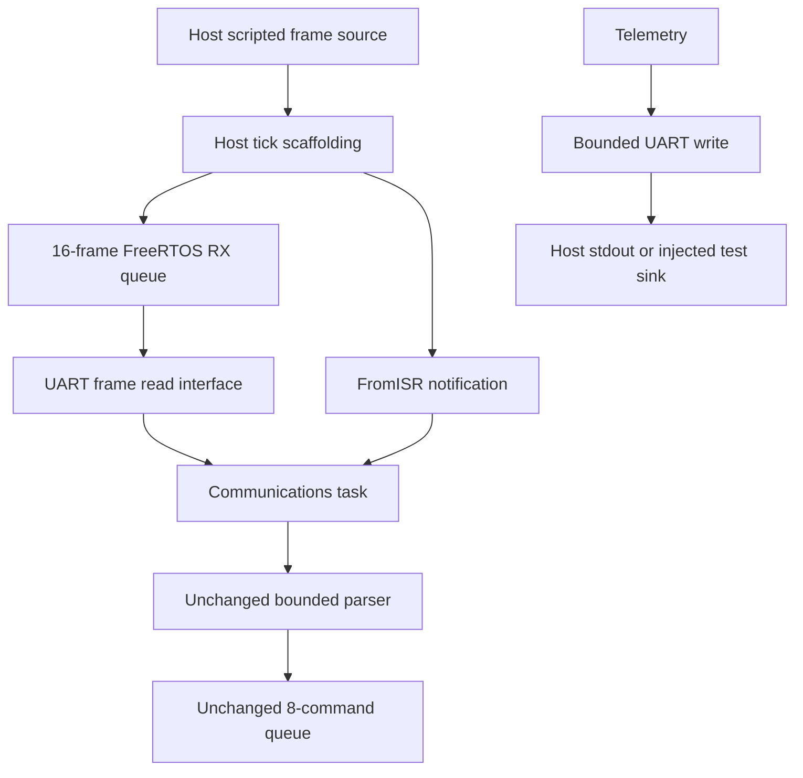

# Phase 3 — embedded peripheral abstractions

> Historical phase report. Behavior and test counts below describe Phase 3 only.
> See [Phase 8](phase-8.md) and [protocol](protocol.md) for the current host baseline.

## Scope and baseline

The existing Debug and Release suites each passed 9/9 tests before any code changes.
FreeRTOS V11.2.0, the official Windows port, four firmware tasks, priorities, periods,
8-command queue, notifications, diagnostics, heartbeat logic and startup state
machine were preserved. Existing unit tests were not weakened or rewritten.

This phase implements UART, GPIO, timer, motor/PWM, encoder and watchdog peripheral
boundaries and working host models. It does not implement a motor plant, PID,
closed-loop motion, complete E-stop/limit behavior, stall handling, homing or final
watchdog enforcement. All movement/safety commands still report NOT_IMPLEMENTED.

## Firmware and host APIs

| Peripheral | Firmware-facing interface | Host-only controls |
| --- | --- | --- |
| Motor/PWM | `motor_init`, `motor_set_output`, `motor_disable`, `motor_get_commanded_output` | Existing `host_motor_enabled` observes whether the stored command is nonzero |
| Encoder | `encoder_init`, `encoder_get_count`, `encoder_set_reference` | `encoder_host_set_count` injects the raw count |
| GPIO | `gpio_init`, `gpio_read_inputs` | `gpio_host_set_estop`, `gpio_host_set_negative_limit`, `gpio_host_set_positive_limit` |
| UART | `uart_init`, `uart_try_read_line`, `uart_rx_pending`, `uart_write` | `uart_host_bind_rx`, `uart_host_set_tx_sink`, `uart_host_get_stats`; existing script input controls |
| Timer | `timer_init`, `timer_now_ms`, `timer_resolution_ms`, `timer_elapsed_ms` | `timer_host_advance_ms`, `timer_host_set_source` |
| Watchdog | `watchdog_init`, `watchdog_refresh` | `watchdog_host_get_state` |

Portable interfaces live in `firmware/drivers`. Host mutation/inspection/configuration
headers live in `firmware/platform/host`. Tasks never call those host-only controls.
The host models use static storage; no new application heap, mutex or semaphore
was introduced. FreeRTOS/native-port allocation policies remain as in Phase 2.

## Initialization and errors

`platform_init` runs before RTOS objects/task creation:

1. Reset motor state first, setting commanded output to zero.
2. Reset the logical timer to zero (1 ms manual resolution).
3. Reset GPIO inputs inactive and encoder raw/reference state to zero.
4. Initialize UART with 115200 baud configuration metadata.
5. Initialize the watchdog model with a 1000 ms timeout.

Memory-only motor/timer/GPIO/encoder resets return void; they have no artificial
success return. UART rejects NULL/zero-baud configuration and watchdog rejects a
missing timer or timeout outside 1..INT32_MAX ms. Failed configuration preserves
an already valid peripheral configuration. `platform_init` propagates UART/watchdog
failure; the runner short-circuits before creating/starting the RTOS on failure.
The default configuration uses those same validated APIs. Motor output is already
zero if later setup fails.

The runner then creates runtime objects/tasks, installs the RTOS time source with
10 ms resolution and the peripheral access hooks, configures the diagnostic sink,
binds the RX script to UART, installs the tick callback and creates the finite host
harness. After scheduler start, Motion owns BOOT → INITIALIZING → IDLE. Tasks
sample peripherals and publish snapshots. They do not initialize/reconfigure them
or refresh the watchdog. Initialization and adapter binding are startup-only.

## Motor/PWM

`motor_set_output` stores a signed duty command. Finite commands in [-1,1] return
MOTOR_OK; finite values outside the range clamp to the nearest endpoint and return
MOTOR_CLAMPED. NaN and either infinity force zero and return MOTOR_INVALID. Calls
before initialization return MOTOR_NOT_INITIALIZED. Disable always forces zero,
even before initialization. Reading before initialization returns the safe zero state.

Disable is not a latched E-stop gate: a subsequent valid driver call can set output.
The existing application continues disabling output on every startup/IDLE step.
There is no PWM waveform, frequency configuration, driver electrical model or plant
coupling yet. A duty command does not alter an encoder count.

## Encoder and GPIO

Encoder reads return a success flag and write a signed count through a pointer.
Before initialization, or with a NULL pointer, they fail without changing output.
The host injector sets the raw peripheral count. `encoder_set_reference(n)` changes
an offset so the current reported count becomes n; subsequent raw changes preserve
that offset. All raw/offset addition/subtraction is modulo 2^32 with explicit signed
conversion, including INT32_MAX → INT32_MIN wrap. No C signed overflow is used.
There is no velocity calculation or physical quadrature decoding.

GPIO provides a coherent `gpio_inputs_t` snapshot of logical active E-stop, negative
limit and positive limit states. Default inputs are inactive. Injection/read calls
before initialization fail; invalid output pointers fail without modifying state.
There is no electrical polarity, pull-up, debounce, GPIO interrupt or safety action.
The RTOS peripheral scenario intentionally shows active E-stop/limits while IDLE
remains unchanged. This is input observability, not safety validation.

## UART architecture



The Phase 2 queue, script timing and notification are retained. `input_line_t` is
now an alias of the protocol-independent `uart_line_t`. The existing input facade
forwards to UART; Communications now directly calls `uart_try_read_line` and
`uart_rx_pending`. UART transport errors have a separate `uart_rx_errors` counter.

UART receives whole frames of up to 64 bytes, with explicit length and no required
NUL terminator. The unchanged command parser accepts at most 63 bytes; a full
64-byte frame is therefore rejected as LINE_TOO_LONG. Script configuration rejects
frames exceeding the physical 64-byte storage. The UART adapter also guards a
malformed backend-reported length greater than 64, returning UART_TOO_LONG without
overwriting the caller's frame. No oversized frame is truncated into an accepted
command. The next valid frame can still be read.

Receive returns UART_EMPTY without blocking when there is no frame. It explicitly
rejects unavailable initialization and invalid pointers. The existing 16-frame
queue rejects/counts new frames when full. Notifications signal readiness, not one
notification per byte or frame. Communications still processes four frames per batch
and Motion two commands per cycle.

TX accepts at most 256 bytes per call, including binary NUL bytes. Oversize input
and invalid pointers are rejected before access. NULL with length zero is a valid
empty write. A host sink returns success/failure; the default uses bounded `fwrite`
and `fflush`. Failure becomes UART_IO_ERROR and increments TX error statistics.
A sink may fail after transmitting some bytes; there is no automatic retry or
atomic on-wire rollback. Successful-call/byte statistics count only complete writes.

Telemetry formats into a fixed 257-byte buffer and sends through `uart_write`.
Formatting that exceeds TX capacity is rejected, not sent as a truncated success.
Telemetry remains the only normal task TX owner. UART does not hold a peripheral
critical section while writing/flushing output. A blocked console may block Telemetry;
higher-priority producers still use the bounded diagnostic queue. Host main's test
summaries and fatal assertions remain host diagnostics outside the normal UART flow.

Baud rate is metadata only; there is no serial port, byte framing, DMA, baud timing
or electrical UART simulation. The tick hook remains host scaffolding. Future STM32
reception should use USART IRQ/DMA → bounded buffer → FromISR notification, or a
dedicated control-timer IRQ for periodic motion. No redesign was forced in Phase 3.

## Timer and watchdog

The timer reports milliseconds modulo 2^32 and its actual model resolution.
Manual mode advances only through the host injector and has 1 ms logical resolution.
The RTOS host selects the existing kernel-tick source with declared 10 ms resolution.
An external source can be bound only once per initialization, before manual time
has advanced; manual advancement then fails. Source callbacks must be monotonic
in the documented modulo domain. Reads do not increment time.

Elapsed time uses unsigned subtraction and is tested across wrap. Intervals lasting
a full 2^32-ms cycle or longer cannot be distinguished. No microsecond API, Windows
high-resolution instrument or wall-clock timing claim was added.

The watchdog stores initialized state, validated timeout, refresh count and last
refresh timestamp. Count zero means never refreshed; its initial timestamp records
initialization time. `watchdog_refresh` fails before initialization. In tests it
updates count and time, but does not simulate expiry, reset or FAULT transitions.
No firmware task calls it; every RTOS scenario verifies refresh count remains zero.
Future supervision must approve refresh only when critical task health is valid.

## Isolation and concurrency

`platform_host` contains plain C models without linking FreeRTOS. Unit tests exercise
the same models in single-threaded mode. The RTOS runner installs host-only access
callbacks backed by task critical sections, protecting short driver operations.
The callbacks permit nesting for watchdog/timer access. No I/O occurs under them.

Normal driver calls and host injections are task/single-threaded operations, not
arbitrary native-thread or ISR APIs. The original RX path alone uses its explicit
FreeRTOS FromISR queue operations. Configuration/source pointers remain immutable
while scheduling. After tasks cooperatively park and the scheduler returns, the
runner detaches access hooks before inspecting final host state.

`hal_isolation` scans portable application/task/RTOS/protocol/health/driver sources
for host headers, direct Windows/pthread includes and host-control calls. It guards
against dependency regressions; it is not a full preprocessor dependency proof.
The original application startup test still links its independent platform double.

## Tests and validation

There are **19 CTest cases**: all nine prior cases plus ten additions:

| New case | Behavior checked |
| --- | --- |
| `peripheral_motor` | Pre-init failure, zero startup, both directions, finite saturation, NaN/Inf zeroing, disable and reinitialization |
| `peripheral_encoder` | Initialization/errors, injected counts, PWM independence, references and signed counter wrap |
| `peripheral_gpio` | Inactive defaults, independent signal injection, clearing and failed reads |
| `peripheral_timer` | Explicit time advancement, unchanged repeated reads, elapsed wrap, source binding and resolution |
| `peripheral_watchdog` | Required timer, invalid timeout, refresh count/time, failed reconfiguration and no automatic refresh |
| `peripheral_uart` | Configuration errors, bounded/binary RX/TX, overlong length, recovery, sink failure and statistics |
| `hal_isolation` | Portable sources do not include or call host controls |
| `rtos_peripherals` | Encoder/GPIO injection observed through Motion/Safety snapshots; output zero, state IDLE, no watchdog refresh |
| `rtos_uart-long` | 64-byte frame rejected by the existing parser; all nine valid commands still delivered |
| `rtos_uart-tx-failure` | Every UART write fails, yet state/command/heartbeat checks still pass |

The original RTOS scenario assertions were retained and extended with initialized
encoder/GPIO snapshots, zero output, zero automatic watchdog refresh and UART-error
checks. The success marker changed from PHASE2_OK to PHASE3_OK; tests still depend
on actual assertion results and process exit status, not that marker alone.

Required commands:

```powershell
./scripts/test.ps1
./scripts/test.ps1 -Configuration Release
./scripts/demo.ps1
cmake -DSOURCE_ROOT=. -P cmake/CheckHalIsolation.cmake
```

All four commands above were executed successfully, including a fresh rerun after
the continuation request. Validation used Windows and the existing MSYS2 UCRT64
x64 GCC/CMake/Ninja toolchain. The native commands ran outside the sandbox, as
required by the previously established host execution limitation.

| Check | Final observed result |
| --- | --- |
| Debug configure/build/test | Passed, **19/19 tests** |
| Release configure/build/test | Passed, **19/19 tests** |
| Default peripheral demo | Passed, `PHASE3_OK`, state IDLE |
| HAL isolation in CTest | Passed in both configurations |
| Standalone HAL isolation command | Passed; no host includes or control calls in scanned portable sources |
| Compiler warnings/errors | **0 reported** in the Phase 3 Debug/Release compilation and final incremental validation |
| Existing Phase 1/2 regressions | All nine still pass |
| New dependencies | None |

The post-continuation builds correctly reported `ninja: no work to do` because no
C sources had changed since their successful Phase 3 compilation. CMake retained
`-Wall -Wextra -Wpedantic -Werror` and verified unchanged vendored FreeRTOS hashes.
No warning suppression was added. Linux CI remains configured but unverified locally;
GitHub CI was not run remotely.

Selected output from the final, actually executed `./scripts/demo.ps1`:

```text
[000020] SYSTEM state=BOOT
[000020] STATE BOOT -> INITIALIZING
[000030] STATE INITIALIZING -> IDLE
[000320] TEL state=IDLE heartbeat=31/16/8 alive=1/1/1 queue=0/8 high_water=1 drops=0 enc=1000 pwm=0.00 gpio=1/1/1
PHASE3_OK scenario=peripherals state=IDLE tasks=0xf queued=9 consumed=9 rejected=0 rx_dropped=0 parse_errors=1 notifications=10 irq_notifications=10 high_water=1 diag_dropped=0
PERIPHERALS encoder=1000 gpio=1/1/1 pwm=0.00 watchdog_refreshes=0 timer_resolution_ms=10 uart_tx_bytes=2696 uart_tx_errors=0
```

GPIO fields are E-stop / negative limit / positive limit. The active inputs are
visible but do not cause a safety transition in this phase. Nine valid commands
were delivered; one malformed command was rejected. UART reported 2696 successfully
written bytes and zero errors in this run. These are observed host results, not
promised fixed counts or physical timing measurements.

The rerun's `rtos_uart-long` case delivered all nine valid commands and reported
two parse rejections (the malformed command plus the 64-byte frame).
`rtos_uart-tx-failure` reported 67 failed TX calls and zero successful TX bytes
while still reaching IDLE, delivering nine commands and passing heartbeat checks.
All RTOS scenarios confirmed initialized watchdog state with zero task-driven
refreshes. Unit tests separately verified explicit refresh count/time behavior.

## Continuation completion record

On resuming, the six peripheral implementations, task integrations, all ten added
tests, HAL guard, initialization documentation and STM32 mapping document already
existed. Debug had passed 19/19; Release and the demo had also completed successfully
just before the continuation message. The validation placeholder in this report
still needed replacing with recorded evidence.

The continuation inspected the existing files, reran Debug, Release, the demo and
the standalone HAL guard, checked the recorded scenario results and finalized the
documentation. No driver/task behavior, test assertion or RTOS architecture was
changed, and no new tests or features were added after resuming.

Files changed after resuming: **`README.md` and `docs/phase-3.md` only**, apart from
generated files/logs under ignored `build/`. `docs/stm32-port.md` was reviewed and
already covered all six peripherals with future-only mappings.

## Files added and modified

Added:

- `firmware/drivers/motor.h`, `encoder.h`, `gpio.h`, `uart.h`, `timer.h`, `watchdog.h`.
- `firmware/platform/host/host_access.c/.h`, `motor_host.c`, `encoder_host.c/.h`,
  `gpio_host.c/.h`, `timer_host.c/.h`, `watchdog_host.c/.h`, `uart_host.c/.h`.
- `tests/test_peripherals.c`, `tests/test_uart.c`, `cmake/CheckHalIsolation.cmake`.
- `docs/phase-3.md`, `docs/stm32-port.md`.

Modified:

- `CMakeLists.txt`, `simulator/main.c`, `scripts/demo.ps1`.
- `firmware/drivers/platform.h`, `firmware/drivers/input.h`.
- `firmware/platform/host/platform_host.c/.h`, `input_host.c`, `telemetry_host.c`.
- `firmware/tasks/motion_task.c`, `safety_task.c`, `comms_task.c`, `firmware/rtos/runtime.h`.
- `README.md`, `docs/architecture.md`, `docs/real-time-design.md`.

Existing tests, application state-machine code, kernel/port sources, license/hash
manifest, build/test scripts and Phase 1/2 reports remain unchanged.

## Changes from Phase 2 and Phase 4 handoff

The concrete interface changes are the UART-backed frame contract, new typed
peripheral contracts, explicit timer-source resolution, bounded UART TX and runtime
peripheral snapshots. `host_set_services` was split into `host_set_log_sink` and
`timer_host_set_source` so clock resolution is explicit. The old time/inhibit/input
facades remain where useful. Default `demo.ps1` now selects the peripheral-injection
scenario; `-Scenario nominal` retains the original demonstration. Task/queue/ISR
design remains intact and test inputs still use complete frames.

Phase 4 should add a deterministic single-axis plant driven by the stored signed
PWM command, integrate its velocity/position using an explicit timestep, feed its
position into raw encoder counts and generate travel-limit inputs. Test the plant
independently and keep all physics inside the simulator/host layer. PID and closed-loop
movement, full safety/fault logic, homing, watchdog enforcement, ARM build and Renode
remain their later phases, not Phase 3 work. Do not describe the current independent
PWM/encoder models as a controlled motor.

Physical STM32 used: **NO**. Physical motor/encoder used: **NO**.
ARM Cortex-M firmware built: **NO**. Renode used: **NO**.
No commits or pushes. Stop after Phase 3.
