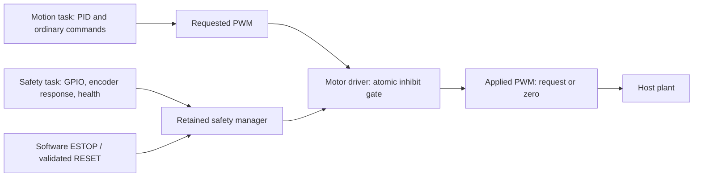

# Firmware safety and fault handling

> This project validates firmware safety behavior using deterministic host simulation.
> It does not implement or claim certified machine safety, safety-rated hardware,
> Safe Torque Off, safety relay functionality, or compliance with industrial
> functional-safety standards.

Real machinery needs appropriate independent removal of hazardous energy, commonly
through safety circuits, safety relays or safety-rated controllers. No IEC 61508 or
ISO 13849 compliance, physical GPIO latency or electrical shutdown is demonstrated.
Zero PWM removes simulated drive; it does not brake the moving plant or prove rest.

## Ownership and final output authority

The portable fault manager retains the first fault code, timestamp, source bitmask
and whether recovery conditions remain active. Later hazards cannot erase that
reason. RESET checks **all** current hazards, even when the first reason masks a
second fault. The last cleared fault is retained in `history`; this is one record,
not a persistent event archive. Restart clears RAM history.

Safety priority 4 exceeds Motion priority 3. Safety runs every 20 ms (50 Hz), Motion
every 10 ms (100 Hz), with the unchanged plant step of 1 ms. The motor driver
serializes `motor_set_output`, `motor_disable` and `motor_safety_inhibit` using the
same nested host access hooks bound to FreeRTOS task critical sections.
An asserted gate immediately zeros applied duty. A subsequent stale request returns
MOTOR_INHIBITED and stays zero. `motor_disable` cannot release the latch. Releasing
the latch never replays a cached request. Startup driver initialization is not an
operational recovery API and must not run concurrently with tasks.

The RTOS adapter serializes safety decisions, RESET and command acceptance. Motion's
bounded scalar PID update and snapshot publication also form one short critical
section, so completion cannot race a detected fault. Encoder sampling, command
queue waits, plant integration and logging are outside that update section. There
is no new mutex, semaphore, application allocation or firmware task. These sections
have not been timed on an MCU; they require target-specific timing review later.

## States, abort and commands

FAULT covers limits, NO_MOTION_UNDER_COMMAND, WATCHDOG, INTERNAL and HOMING_TIMEOUT. ESTOP remains a
distinct, higher-priority safety state and can coexist with a retained fault reason.
Safety immediately publishes the unsafe runtime state and applies the gate. On its
next release Motion adopts that state, increments `aborted_moves` for active motion,
discards the target, clears dwell and resets PID. It does not increment completed
moves or emit successful completion for that abort.

| Command | Normal operation | FAULT / ESTOP |
| --- | --- | --- |
| MOVE / MOVE_REL | Existing IDLE, feedback and travel validation | INVALID_STATE |
| SPEED | NOT_IMPLEMENTED | INVALID_STATE |
| HOME | Safe IDLE only; fixed-duty seek and reference establishment | INVALID_STATE |
| STATUS / HELP | Diagnostic service | Still allowed |
| STOP | Zero drive, STOPPING until low-speed dwell | Acknowledge already safe; retain latch |
| ESTOP | Latch ESTOP, zero drive when Motion consumes command | Remain / enter ESTOP |
| RESET | IDLE validation; rejected during MOVING/STOPPING/HOMING | Validate hazards, then IDLE and zero |

Software ESTOP travels through the existing bounded UART/command queue. Queue
admission is not execution and is not an out-of-band emergency channel. Physical
GPIO E-stop is independently sampled by Safety. Both latch ESTOP; physical input
clearing alone never resumes operation. RESET rejects while GPIO E-stop is active.
Software ESTOP's internal latch can clear through RESET only with physical inputs
safe, healthy critical tasks and no remaining fault recovery condition.

## Limits

An unexpected active limit faults, including activation at IDLE. That retained fault
inhibits both directions until the input clears and RESET succeeds. Phase 7 adds
only two scoped exceptions: expected negative contact during HOMING, and contact
retained immediately after successful HOME. A positive-limit event during HOME
still faults. There is no recovery jog or HOME bypass of a previously latched fault.

Successful HOME grants a temporary contact allowance: IDLE remains at zero with the
full gate inhibited; only an explicit positive MOVE/MOVE_REL may depart. A second
atomic guard rejects negative duty while the switch remains active. First observed
release revokes the allowance; later unexpected contact faults normally. Any safety
trip revokes it too. See [homing](homing.md) for command, startup and RESET details.

Targets remain validated against 0..5000. Endpoints are inclusive in the command
range but activate automatic switches; arriving at a hard endpoint may fault rather
than complete normally. Ordinary production trajectories should avoid the switches.
Multi-stage homing and recovery jogging remain outside this phase.

## No motion under command

Safety uses only firmware-visible applied PWM and encoder-derived velocity:

| Parameter | Value |
| --- | --- |
| Qualifying state | MOVING or HOMING with valid feedback and no safety latch; expected home contact excluded |
| Minimum absolute PWM | 0.3, inclusive |
| Maximum absolute estimated velocity | 25 counts/s, inclusive |
| Continuous duration | 500 ms, inclusive |
| Evaluation interval | 20 ms |
| Post-fault encoder recovery evidence | At least 2 counts displacement while inhibited |

A candidate begins on the first qualifying Safety observation. Any nonqualifying
observation resets its timer. IDLE, STOPPING, zero PWM, low PWM and renewed encoder
motion do not accumulate stall time. The 500 ms duration avoids normal acceleration
and preserves the original finite manual-feedback MOVE-to-STOP regression. Boundary,
transient, zero-distance and ordinary-motion tests exercise false-positive avoidance.
At the default quantization, one count per 10 ms is 100 counts/s; this detector sees
sampled no-response evidence rather than precise mechanical speed.

The host's `stalled` condition holds mechanics stationary with truthful stationary
encoder feedback. `encoder_frozen` lets mechanics and limits continue while encoder
publication stops. Firmware cannot distinguish these failures from PWM and counts
alone, so both correctly latch NO_MOTION_UNDER_COMMAND after the same timeout.
It does not claim general detection of encoder noise, incorrect scale, intermittent
failure or plausible but wrong moving feedback.

Removing a mechanical obstruction while drive is zero produces no new evidence.
RESET therefore remains rejected until at least two counts of encoder displacement
have been observed while inhibited. The stall scenario explicitly models a manual
service displacement after removing the obstruction; restoring a frozen encoder
reveals the plant's displaced position. This is a limited recovery check, not proof
that a sensor or machine is safe. No firmware code reads injection flags or plant
position/velocity. If feedback cannot be validated, leave drive inhibited and service
the system. Restored feedback alone does not clear the latch.

## Heartbeats and watchdog

Motion, Safety and Communications are critical. Their expected periods are 10 ms,
20 ms and at most 50 ms idle, respectively. A heartbeat is fresh through age 150 ms;
missing/unseen or older observations inhibit output. A 200 ms startup grace permits
tasks to start before latching WATCHDOG, while the gate remains inhibited until all
are fresh. Only Safety, after evaluating all three records, calls watchdog_refresh.
Telemetry is noncritical: UART sink failures and dropped diagnostic records cannot
prevent safety action or healthy refreshes.

Option A is implemented: Safety latches WATCHDOG on failed supervision before the
configured 1000 ms watchdog timeout. The host watchdog stores refresh count/time
but does not autonomously expire or reset the process. Refreshes stop while any
critical heartbeat is unhealthy; restoration permits refresh but not motion until
RESET. Refresh may continue in another safely inhibited FAULT/ESTOP state if all
critical tasks are healthy.

The simulator installs a heartbeat observation filter before scheduling and changes
its private drop mask under task synchronization. Tasks continue executing; only
selected heartbeat observations disappear. Dropping Safety's heartbeat demonstrates
self-health evaluation while Safety still runs. It does **not** prove handling of a
stopped Safety task, deadlocked kernel or frozen CPU. A future independent STM32
IWDG and hardware energy removal must cover those cases; no MCU reset is claimed.

## RESET and internal faults

HOMING_TIMEOUT ends the attempt at 40000 ms and retains FAULT. RESET validates the
same physical/health conditions before permitting a fresh HOME; it does not prove
an unseen sensor repaired. No timeout, STOP, ESTOP or fault automatically resumes
homing. No-motion recovery evidence remains required during homing just as for MOVE.

RESET re-reads GPIO and encoder and reevaluates current task health under the same
critical section as state/gate changes. It rejects invalid GPIO, E-stop, either
limit, missing critical heartbeat, outstanding encoder recovery evidence or an
INTERNAL fault. A successful RESET retains fault history, discards the prior motion
target, clears PID/dwell and releases the gate with zero output. A new MOVE is required.

Invalid feedback/dt/arithmetic and failed GPIO access become INTERNAL faults.
Ordinary RESET cannot establish integrity after these failures; they require service
and restart. This deliberately differs from recoverable GPIO/no-response/health
faults and from Phase 5's transient control-error return to IDLE.

## Simulation, diagnostics and timing evidence

The existing closed-loop runner releases Safety every second logical control cycle,
before Motion; Comms is notified every cycle. Default periodic firmware scheduling
remains unchanged. Injected faults are host scenario controls, never SIM commands in
the firmware parser. E-stop is injected through the GPIO host API, limits through
plant endpoint placement, and mechanical/frozen-feedback conditions through the
single-owner plant flags.

Telemetry exposes the current state, retained fault/time/source/active condition,
E-stop/limits, candidate duration, encoder-recovery requirement, unhealthy mask,
watchdog refresh count, requested/applied duty and aborted moves. Event records are
bounded; Safety forces the gate before attempting logs. Demo playback shows safety
state changes and requested duty captured at the trip. Quiet replay compares the
scenario results, recovery move metrics and measured timing across processes.

The E-stop scenarios record input time, Safety detection time and observed zero
output time. Detection-to-zero is zero simulated milliseconds in the detecting
critical section. Input-to-detection depends on the 20 ms release phase. These are
controller-cycle measurements, not Windows scheduling bounds, physical GPIO/ISR
latency, electrical shutdown delay or certified emergency-stop response times.
