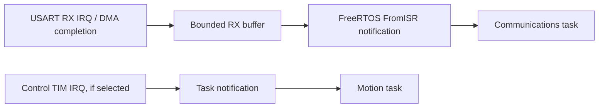

# Future STM32 mapping for Phase 3 peripherals

Only the host column is implemented. No STM32 part/board or pin allocation is
selected, no STM32 HAL sources are compiled, and there is no ARM binary or Renode
execution. Peripheral availability, counter width, interrupt routing and pin choices
must be checked against the eventual target's reference manual and board wiring.

| Abstraction | Implemented host model | Future STM32 implementation |
| --- | --- | --- |
| UART | 16-frame RX queue/notification adapter and bounded TX sink; baud metadata | USART RX IRQ or DMA plus bounded buffer; task framing/notification; IRQ/DMA TX with explicit full/error policy |
| GPIO | Logical E-stop and two limit inputs with coherent read/injection | GPIO input sampling, electrical polarity configuration; EXTI only when interrupt-driven events are required |
| Motor/PWM | Stored signed duty, finite saturation, NaN/Inf zeroing | Appropriate TIM PWM channel(s), compare value, direction/enable GPIO and safe startup/shutdown sequence |
| Encoder | Injected 32-bit raw counter plus modulo reference offset | TIM encoder interface mode for quadrature inputs, hardware counter read and count-width extension/reference policy |
| Timer | Manual logical milliseconds or declared-resolution RTOS tick source | Appropriate TIM or Cortex-M/RTOS time source with documented resolution and wrap; dedicated control timer if needed |
| Watchdog | Validated timeout and observable refresh count/time; no reset | IWDG configuration/refresh, driven only by a qualified supervisor; clock-tolerance and reset-cause handling |

TIM devices can provide PWM and quadrature encoder functions, but exact timer
capabilities depend on the selected MCU. See ST's [timer introduction](https://wiki.st.com/stm32mcu/wiki/Getting_started_with_TIM).
GPIO event routing through EXTI also requires explicit configuration; see ST's
[EXTI introduction](https://wiki.st.com/stm32mcu/wiki/Getting_started_with_EXTI).
ST's [system peripheral documentation](https://wiki.st.com/stm32mcu/wiki/Getting_started_with_STM32_system_peripherals)
indexes the UART, GPIO, timer, DMA and watchdog material for target-specific work.

## Future interrupt flow

The current host tick callback releasing whole scripted frames is validation
scaffolding, not a proposed final UART interrupt handler. A target implementation
must set NVIC priorities compatible with FreeRTOS syscall restrictions, keep ISR
work bounded and use the selected Cortex-M port's yield-at-exit mechanism.
Protocol parsing and telemetry formatting stay in task context.

## Porting obligations, not completed work

Keep portable code on the existing driver interfaces and bind actual target driver
definitions at link time. Propagate fallible clock/peripheral setup through system
initialization before starting the scheduler; do not silently map a failed hardware
operation to a successful host-model reset. Initialize motor outputs disabled before
other setup. Choose actual PWM frequency, H-bridge direction behavior, encoder width,
input polarity/debounce, UART framing/overflow rules and IWDG timeout for the board.

The current motor disable operation is not a hardware emergency-stop circuit.
GPIO inputs do not yet cause faults and the watchdog model does not expire. Future
software safety and physical validation must establish the real shutdown behavior.
IWDG is the primary planned watchdog mapping; no WWDG implementation or claim is
needed in this phase. Host tests prove interface/model behavior, not these hardware
properties.
